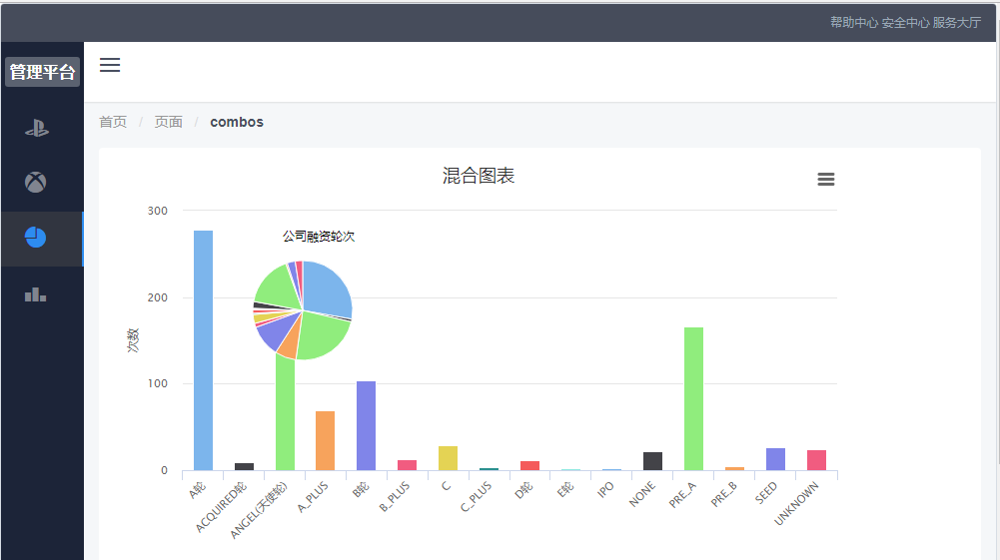
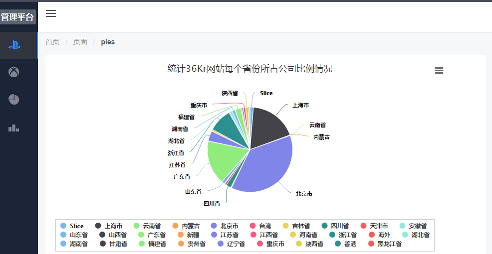
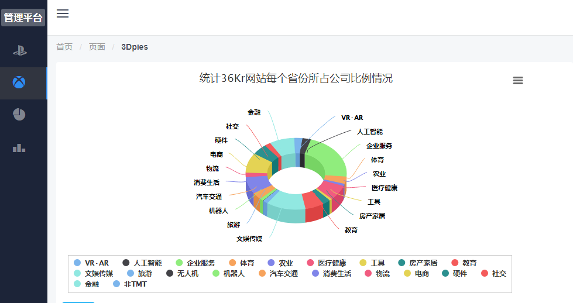
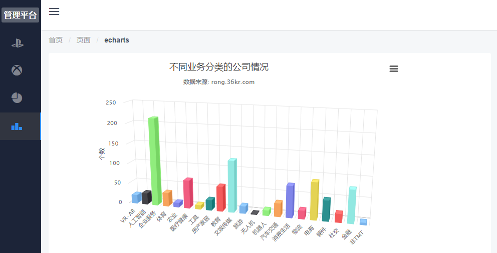

# vue-management

> 基于vue的数据可视化管理系统

## 开发环境
1. Node.js 
2. MongoDB 
3. Vue.js 


## 使用到的技术
### 前端
1. Vue.js
2. vue-cli
3. vue-router
4. axios
5. iview


### 后端
1. Node.js
2. Express
3. Mongoose

## 截图

混合图



饼图



3D饼图



柱状图




## Build Setup

``` bash
# install dependencies
npm install

# serve with hot reload at localhost:8080
npm run dev

# build for production with minification
npm run build

# build for production and view the bundle analyzer report
npm run build --report
```

For detailed explanation on how things work, checkout the [guide](http://vuejs-templates.github.io/webpack/) and [docs for vue-loader](http://vuejs.github.io/vue-loader).
